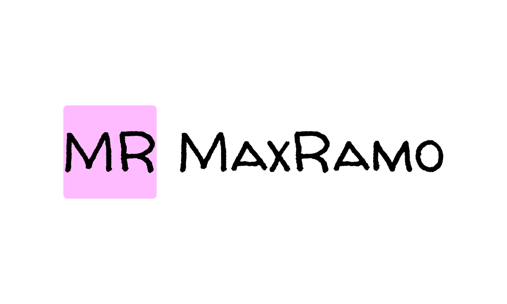

# 🌐 Max Ramo – Desarrollador & Artista

Portfolio personal creado con **Next.js 14**, donde fusiono **tecnología y arte** para construir experiencias digitales con identidad.  
Combino mi experiencia como **Desarrollador Web & Blockchain** y **Artista Tatuador** , integrando creatividad y precisión técnica en cada proyecto.

---

## 🚀 Tecnologías principales

- ⚛️ **Next.js 14** (App Router)
- 💅 **TailwindCSS**
- 🎬 **Framer Motion** (animaciones)
- 🧠 **TypeScript**
- 🪶 **Vercel** (hosting y deploy)
- 🧱 **Solidity / Hardhat** (para proyectos Web3)
- 🗄️ **PostgreSQL / MongoDB**
- 🎨 **Diseño UI/UX centrado en experiencia**

---

## 📁 Estructura del proyecto


---

## 🧩 Características destacadas

- 🖼️ **Open Graph personalizado:** genera miniatura al compartir el sitio en redes.  
- 🧠 **SEO optimizado:** metadatos, keywords y schema JSON-LD.  
- ⚡ **Performance y accesibilidad:** diseñado con foco en velocidad y claridad visual.  
- 🎭 **Identidad visual única:** tipografía, ritmo y estructura coherente con la marca personal.

---

## 🧠 Filosofía de desarrollo

> “Cada línea de código debe tener propósito, cada interfaz debe ser intuitiva,  
> y cada experiencia digital debe dejar una impresión duradera.”

Mi objetivo es **fusionar ingeniería y arte** para construir productos digitales memorables.

---

## 🖼️ Previsualización



---

## 🔧 Configuración local

1. Cloná el repositorio  
   ```bash
   git clone https://github.com/maxramo/max-ramo-website.git
